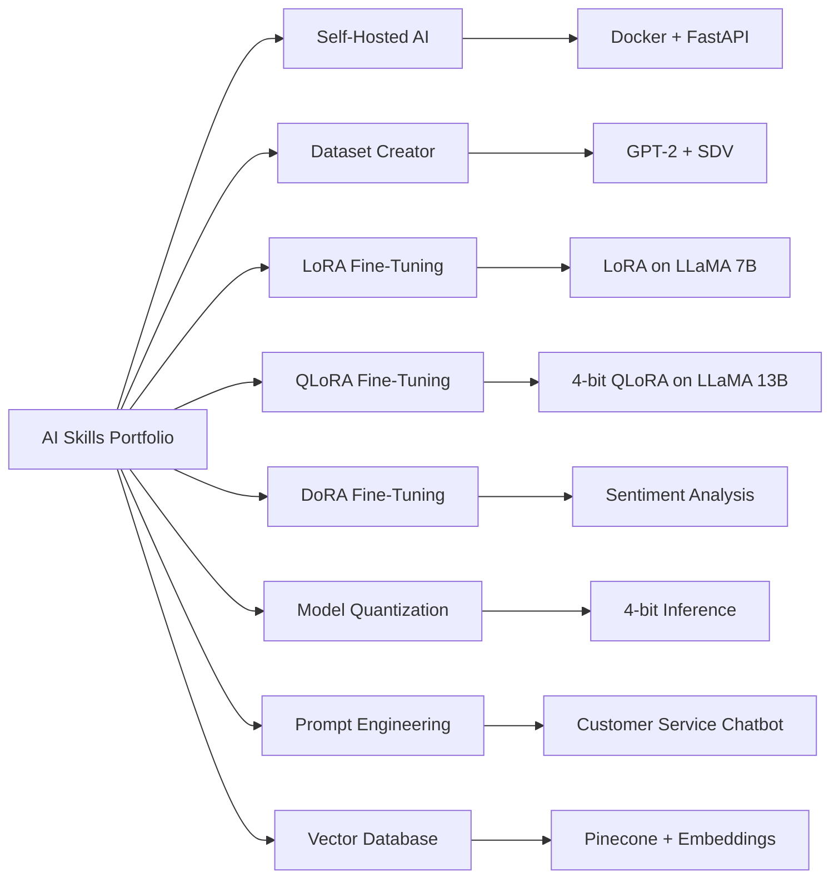
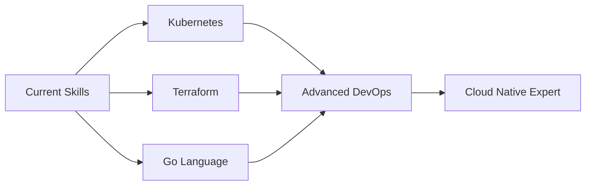

# <div align="center">👋 Hello </div>

<div align="center">
  
</div>

<div align="center">

[](#)

</div>

---

##  About Me


```yaml


name: Sabir Khan
current_job: IT Specialist
education: ["Self-taught", "Continuous Learning"]
company: Open to DevOps, Automation & Infrastructure roles


fields_of_interests: ["DevOps", "Cloud Architecture", "Automation", "Security"]
currently_learning: ["Kubernetes", "Terraform", "Go"]
hobbies: ["Coding", "Server Tinkering", "Problem Solving", "Tech Blogging"]


```

<br>

---

##  Tech Stack & Tools

<div align="center">

### 💻 Programming Languages


### 🚀 DevOps & Cloud


### 🖥️ Infrastructure & OS


### 📊 Monitoring & Analytics


</div>

---

## 🧠 AI Skills Portfolio

<div align="center">



</div>

---

##  Current Learning Journey

<div align="center">



</div>

---

##  Philosophy & Mindset

<div align="center">

### 💡 Core Principles

<table>
<tr>
<td align="center" width="33%">

<br><b>Automate Everything</b>
<br><i>"Script what you repeat"</i>
</td>
<td align="center" width="33%">

<br><b>Security First</b>
<br><i>"Secure what you deploy"</i>
</td>
<td align="center" width="33%">

<br><b>Continuous Learning</b>
<br><i>"Learn what you break"</i>
</td>
</tr>
</table>

</div>

>  **"The best infrastructure is the one you never have to think about"**

---

<div align="center">
  
</div>

<div align="center">
  
</div>

---

<div align="center">
  <i>⭐️ From <a href="https://github.com/kamilracz">skullcrs</a> with ❤️</i>
</div>

---
